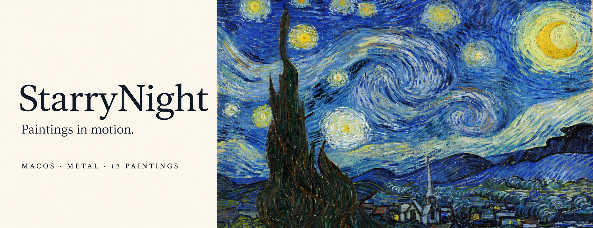
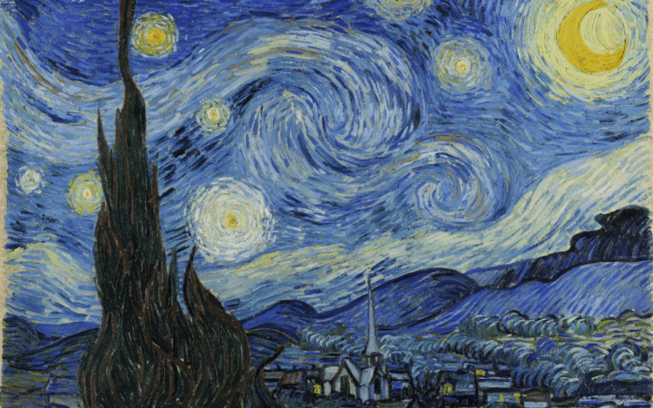
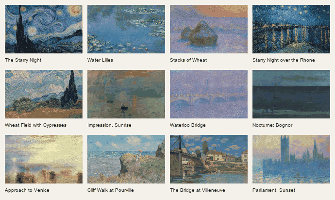
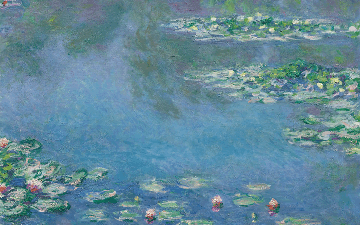
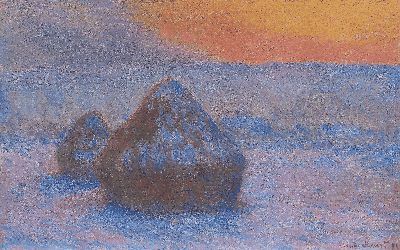
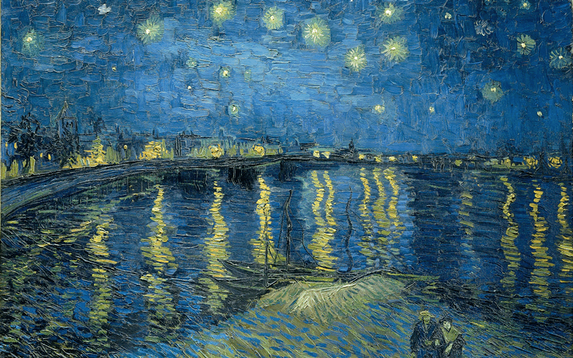
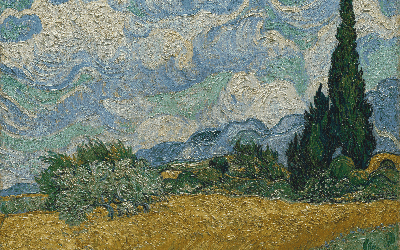

# StarryNight

[简体中文](README.zh-CN.md) · [Download](https://github.com/Rosemary1812/starry-night-wallpaper/releases) · [Painting sources](THIRD-PARTY-NOTICES.md)

Turn paintings into animated wallpapers on your Mac. StarryNight pairs a native gallery with a Metal renderer: clouds follow the brushwork, water and reflections ripple, and foreground subjects stay still.

The current source has **12 paintings**, an infinitely scrolling gallery, live previews for every painting, and a black-and-white app icon adapted from *The Starry Night*. The interface supports English, Simplified Chinese, and Traditional Chinese.



## Browse the collection

Scroll or drag in either direction without reaching an end. Select a thumbnail or use the arrow keys to move between paintings. Once a selection settles, its live preview starts; neighboring cards remain still.



The GIFs above show complete 24-second loops at the default speed and intensity. They are captured from the production Metal renderer, reduced to 4 fps for the README. Wallpaper videos render at 30 fps. These are renderer captures, not recordings of macOS lock-screen playback.

| Painting | Artist · year | Motion and protected subjects | Shortcut |
| --- | --- | --- | --- |
| The Starry Night | Vincent van Gogh · 1889 | Flowing sky brushwork; cypress, hills, and village stay still. | ⌘1 |
| Water Lilies | Claude Monet · 1906 | Water and reflections ripple; main lily clusters stay still. | ⌘2 |
| Stacks of Wheat (Sunset, Snow Effect) | Claude Monet · 1890–1891 | Warm sky areas change in brightness; stacks, snow, and all geometry stay still. | ⌘3 |
| Starry Night over the Rhône | Vincent van Gogh · 1888 | River and light reflections shimmer; shore, mast, and figures stay still. | ⌘4 |
| Wheat Field with Cypresses | Vincent van Gogh · 1889 | Clouds and wheat move; main cypress and middle hills stay still. | ⌘5 |
| Impression, Sunrise | Claude Monet · 1872 | Water and orange reflections ripple; sun, boats, figures, and harbor stay still. | ⌘6 |
| Waterloo Bridge, Sunlight Effect | Claude Monet · 1903 | River and arch reflections move; bridge and skyline stay still. | ⌘7 |
| Nocturne: Blue and Silver, Bognor | James McNeill Whistler · 1871–1876 | Sea swells slowly; horizon, sailboats, beach figures, and shore stay still. | ⌘8 |
| Approach to Venice | J. M. W. Turner · 1844 | Lagoon shimmers; sky, city, gondolas, and rigging stay still. | ⌘9 |
| Cliff Walk at Pourville | Claude Monet · 1882 | Clouds, exposed sea, and grass move separately; figures, parasol, paths, and cliffs stay still. | ⌘0 |
| The Bridge at Villeneuve-la-Garenne | Alfred Sisley · 1872 | River currents move; bridge, boats, buildings, and people stay still. | ⌥⌘1 |
| The Houses of Parliament, Sunset | Claude Monet · 1903 | Short reflection strokes move; architecture, boats, sky, and signature stay still. | ⌥⌘2 |

Each painting has its own motion field and subject mask. *Stacks of Wheat* uses a local brightness change rather than displacement, so its motion is intentionally quieter.

<details>
<summary>View four more full-size motion previews</summary>

### Water Lilies



### Stacks of Wheat



### Starry Night over the Rhône



### Wheat Field with Cypresses



</details>

## Get the app

StarryNight requires **macOS 26 and an Apple Silicon Mac**.

1. Download the ZIP archive from [GitHub Releases](https://github.com/Rosemary1812/starry-night-wallpaper/releases).
2. Extract it and move `Starry Night.app` into Applications.
3. Open the app. If macOS blocks it, Control-click it in Finder and choose **Open**.

Release archives include a SHA-256 checksum file. The latest published release, [v0.2.0](https://github.com/Rosemary1812/starry-night-wallpaper/releases/tag/v0.2.0), has the earlier five-painting control panel. The twelve-painting gallery and the media on this page describe the current `main` branch.

This is an experimental extension that uses private macOS APIs. Builds use an ad hoc signature, are not notarized, and are not intended for the Mac App Store. macOS updates may affect extension compatibility.

## Set your wallpaper

1. Open the app and choose a painting.
2. Click **Adjust…** to set the motion speed and intensity.
3. Click **Set Wallpaper** and wait for rendering to finish.
4. Open **System Settings → Wallpaper** and choose **StarryNight** if macOS has not selected it.

On first use, open Wallpaper Settings once so macOS can initialize the extension. The app prepares the selected painting's video and tells the extension that a new render is available.

Changing a painting or a slider updates the preview. Click **Set Wallpaper** again to update the system wallpaper. Preview-only messages are hidden; rendering progress and the applied wallpaper state appear when relevant.

### Adjust the preview

| Control | Behavior |
| --- | --- |
| Speed | 0.25× to 2×. A loop lasts 24 seconds at 1×, 96 seconds at 0.25×, or 12 seconds at 2×. |
| Intensity | 0% to 250%; the default is 140%. At 0%, displacement and animated brightness are off. |
| Pause Preview | Pauses this window's animation. System wallpaper playback continues. |
| Show motion mask | Temporarily highlights the animated regions in the preview. |
| Language | Follow System, English, 简体中文, or 繁體中文. Your choice persists after relaunch. |

The gallery follows macOS light and dark appearance and Reduce Motion. Wide windows put the caption beside the painting; narrow windows put it below. The app appears in the Dock with its monochrome icon.

### Export a video

Open the **…** menu and choose **Export Video…**. Export saves a looping H.264 MP4 at 30 fps, using the selected speed and intensity. It uses a 3840-pixel width and the main screen's aspect ratio. Export does not apply a wallpaper.

**Set Wallpaper** renders at a 2560-pixel width with the same screen aspect ratio. Both paths crop the painting to fill the output; the app does not stretch the painting. The **…** menu also contains artwork details, sources and licenses, and Wallpaper Settings.

## Build the current source

You need macOS 26, Apple Silicon, Xcode Command Line Tools, and the artwork assets. The app and extension use Swift, AppKit, Metal, and AVFoundation. Building the app does not require Python or FFmpeg.

```sh
git clone --branch main https://github.com/Rosemary1812/starry-night-wallpaper.git
cd starry-night-wallpaper
xcode-select --install
mkdir -p assets
```

Skip `xcode-select --install` if the tools are already installed.

Put a legally usable reproduction of *The Starry Night* at `assets/starrynight.jpg`. A [public-domain reproduction on Wikimedia Commons](https://commons.wikimedia.org/wiki/File:Van_Gogh_-_Starry_Night_-_Google_Art_Project.jpg) is one option. Download a reduced-size version rather than the very large original file.

Download the other eleven images:

```sh
zsh scripts/fetch-artworks.sh
```

The full extension build also needs a seed loop at `assets/starry-night-flow.mp4`. If you do not have one, build the control panel first and use its renderer to create the loop:

```sh
STARRY_SKIP_EXTENSION_BUILD=1 zsh build.sh
"./Starry Night.app/Contents/MacOS/StarryNight" \
	--export "$PWD/assets/starry-night-flow.mp4" 2560 1600
zsh build.sh
open "Starry Night.app"
```

The first command creates a preview app. The final build includes the wallpaper extension and signs both bundles. Build output stays in the repository; the scripts do not install the app or apply a wallpaper.

To keep the images and seed movie elsewhere, set `STARRY_ASSETS_DIR` before downloading and building. For the export command, use the seed movie path in that directory as well. Full-size source images and videos are ignored by Git; reduced documentation media is tracked.

### Render from the command line

Use the artwork's filename without `.jpg` for `--artwork`. Create `dist/` before running these examples:

```sh
mkdir -p dist
"./Starry Night.app/Contents/MacOS/StarryNight" \
	--snapshot "$PWD/dist/rhone.png" 8 --artwork rhone
"./Starry Night.app/Contents/MacOS/StarryNight" \
	--export "$PWD/dist/rhone.mp4" 1920 1080 --artwork rhone
```

Snapshots use the painting's aspect ratio. Command-line video export uses a 24-second loop at speed 1× and intensity 140%. It does not publish the video to the extension.

## Troubleshoot

| Symptom | What to do |
| --- | --- |
| The app asks you to open Wallpaper Settings first. | Open **System Settings → Wallpaper** once, then return to the app and click **Set Wallpaper**. |
| Rendering finishes but the desktop still shows the previous wallpaper. | Select **StarryNight** in Wallpaper Settings. Preview changes alone do not update the desktop. |
| The preview moves but a neighboring painting does not. | Select that painting. Only the settled selection has a live Metal preview. |
| Some motion is hard to see. | Increase intensity in **Adjust…**. Wheat stacks use a restrained brightness change; objects remain fixed. |
| Selection or action buttons are temporarily disabled. | Wait for video rendering to finish or for the carousel selection to settle. |
| A source build reports a missing image or seed video. | Check the filenames in `assets/`, or the directory specified by `STARRY_ASSETS_DIR`. |

The applied status reports whether the provider is selected in macOS settings. It is not proof of playback on every display, Space, or lock screen.

## Verify and contribute

With the source assets available, run:

```sh
STARRY_VERIFY_EXPECTED_ARTWORK_COUNT=12 zsh scripts/verify-gallery.sh
```

This rebuilds the control panel, checks localization, runs the carousel's motion assertions, captures AppKit layouts, and checks native Metal loop endpoints, movement, and protected-subject sample points for all twelve paintings. Evidence goes into `dist/gallery-evidence/` and `dist/evidence/`. Protected-point checks do not prove that every silhouette pixel is fixed.

To check visible live previews and the wrap between the last and first paintings:

```sh
STARRY_VERIFY_LIVE_PREVIEW=1 \
	"./Starry Night.app/Contents/MacOS/StarryNight" \
	--ui-check "$PWD/dist/live-preview-evidence"
```

This opens a window and checks completed GPU frames for every painting. Offscreen AppKit snapshots use a still fallback because `cacheDisplay` cannot capture Metal presentation layers. These checks do not apply wallpaper or verify lock-screen playback.

To regenerate the README GIFs, install Pillow in your Python environment and run:

```sh
python3 -m pip install Pillow
zsh scripts/record-readme-media.sh
```

Set `STARRY_PYTHON` if Pillow is installed in a different interpreter. Capture settings, media attribution, and output sizes are documented in [docs/media/README.md](docs/media/README.md).

Start with the [painting wallpaper authoring skill](.agents/skills/author-painting-wallpaper/SKILL.md) before adding a painting or changing its motion. It covers image rights, subject masks, gallery integration, and native rendering evidence.

### Code map

| File or directory | Responsibility |
| --- | --- |
| `Artwork.swift` | Painting IDs, filenames, crops, years, and shortcuts. |
| `StarryNight.swift` and `Sky.metal` | Native preview, masks, motion, video export, and app lifecycle. |
| `GalleryView.swift` and `CarouselMotion.swift` | Gallery drawing, controls, input, and infinite scrolling. |
| `L10n.swift` and the three `.lproj` directories | Language selection and localized strings. |
| `WallpaperBridge.swift` | Publishes renders to the extension's local video library. |
| `WallpaperExtension/` | Native wallpaper provider and video playback. |
| `Icons/` and `Fonts/` | App icon and bundled interface font. |
| `scripts/` | Builds, asset downloads, capture tools, and verification. |

## Credits and licenses

Code is licensed under MIT. The wallpaper extension derives from [Phosphene](https://github.com/kageroumado/phosphene), and the app bundles Adobe Source Serif 4 under the SIL Open Font License.

Painting reproductions have their own terms. In particular, the *Waterloo Bridge* reproduction and its animated derivatives retain **CC BY-SA 4.0**, credited to Claude Monet / Art Institute of Chicago, via Wikimedia Commons uploader Maltaper. The collection GIF includes that derivative. Read [THIRD-PARTY-NOTICES.md](THIRD-PARTY-NOTICES.md) before redistributing artwork media.
