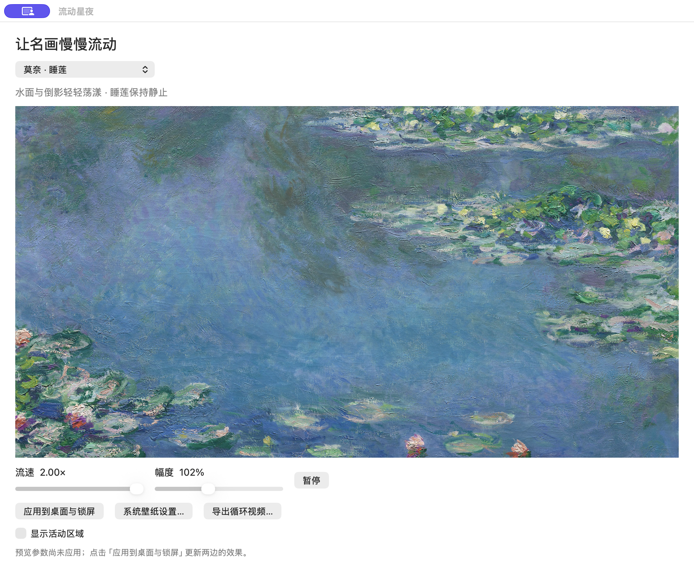
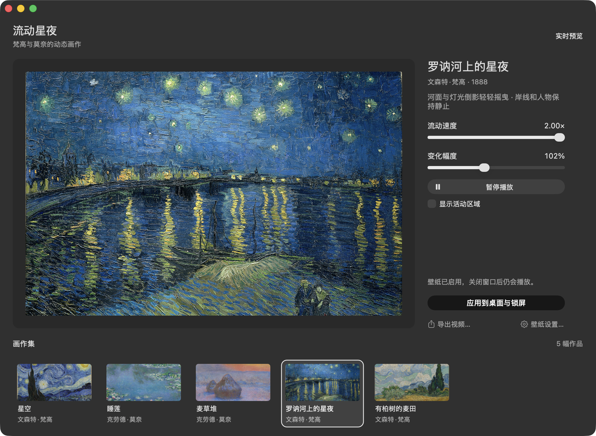

# Starry Night Wallpaper

[简体中文](README.zh-CN.md)

An experimental macOS 26 dynamic wallpaper extension with a Metal control panel. Choose a painting, adjust its motion, and render a looping video for the desktop and lock screen.


## Painting collection

The collection includes Van Gogh's *The Starry Night* and eleven more paintings. Motion is deliberately subtle; masks protect the main subjects.

### Monet — Water Lilies (1906)

Water and reflections ripple gently; the main lily clusters stay still.


### Monet — Stacks of Wheat (Sunset, Snow Effect) (1890–91)

A faint local glow changes only in the warm part of the sky; the sky geometry, stacks and snow remain still.


### Van Gogh — Starry Night over the Rhône (1888)

The river and reflected lights shimmer; the shoreline, boat mast, and foreground figures remain still.


### Van Gogh — Wheat Field with Cypresses (1889)

Clouds and wheat move gently; the main cypress and middle hills remain still.


### Monet — Impression, Sunrise (1872)

The water and orange reflections ripple subtly in a seamless 24-second loop. The sun, harbor silhouettes, three boats and their figures, and the artist's signature stay still. Select it with Command-6.

### Six additional paintings

- **Monet — Waterloo Bridge, Sunlight Effect (1903):** horizontal river ripples and quiet arch reflections; masonry, skyline and signature stay still.
- **Whistler — Nocturne: Blue and Silver—Bognor (1871–1876):** a slow, restrained sea swell; horizon, sailing boats, beach figures and shoreline stay still.
- **Turner — Approach to Venice (1844):** delicate lagoon shimmer; sky, city, gondolas and rigging stay still.
- **Monet — Cliff Walk at Pourville (1882):** separate cloud drift, exposed-sea ripples and sparse grass sway; figures, parasol, paths and solid cliff faces stay still.
- **Sisley — The Bridge at Villeneuve-la-Garenne (1872):** local river currents; bridge, piers, boats, buildings and people stay still. The reproduction's black surround is removed consistently in thumbnails, preview and export.
- **Monet — The Houses of Parliament, Sunset (1903):** short horizontal reflection strokes; architecture, boats, sky and signature stay still.

Each has a dedicated subject mask and distinct motion field. The six additions use constant illumination, without whole-image breathing. *Waterloo Bridge* uses a CC BY-SA 4.0 reproduction; retain the attribution and share-alike terms for that image and its visual derivatives, as detailed in [THIRD-PARTY-NOTICES.md](THIRD-PARTY-NOTICES.md).

## Gallery control panel

The gallery uses a black, white, and gray interface. Paintings retain their original colors. Select a painting from the thumbnail strip. The right panel shows the title, artist, year, flow speed, and motion amplitude.

The black **应用到桌面与锁屏** button applies the current preview. Export and system settings are secondary actions. The interface follows the Mac's light or dark appearance.





These screenshots show an earlier five-painting native build on a Mac. The current source extends the same gallery to twelve paintings; its updated native UI still requires Mac verification. The v0.2.0 downloadable app still has the earlier control panel.

## Download

Download from [GitHub Releases](https://github.com/Rosemary1812/starry-night-wallpaper/releases) for Apple Silicon Macs running macOS 26. Release packages include a ZIP archive and a SHA-256 checksum. The original v0.1.0 contains only The Starry Night.

This build uses private macOS APIs. It is not notarized and is not suitable for the Mac App Store. macOS may require you to Control-click the app in Finder and select **Open**. A future macOS update can stop the extension from working.

## Build from source

You need an Apple Silicon Mac running macOS 26, Xcode Command Line Tools, a legally usable image, and a looping video.

1. Create `assets/`.
2. Put the image at `assets/starrynight.jpg`.
3. Put the video at `assets/starry-night-flow.mp4`.
4. Run `zsh scripts/fetch-artworks.sh` to download the eleven additional reproductions (see artwork-specific image licenses).
5. Run `zsh build.sh`.

The build creates `Starry Night.app` in the repository and signs it with an ad hoc signature. It does not install the app or change your wallpaper. To keep assets elsewhere, set `STARRY_ASSETS_DIR` to the directory that contains all image and video assets before downloading and building.

The repository does not include the full-size source image or video that the build needs. The documentation media is a reduced-size preview only. Use assets that you have the right to distribute.

## Use

Open `Starry Night.app` and select a painting from the bottom thumbnail strip. You can also use Command-1 through Command-9, Command-0 for the tenth painting, and Option-Command-1 / Option-Command-2 for the last two. Adjust **流动速度** for speed and **变化幅度** for motion amplitude.

Click **应用到桌面与锁屏** to apply the preview. In **System Settings > Wallpaper**, select **流动星夜**. Set the screen saver to use the same wallpaper for the lock-screen effect. Changing paintings or sliders updates only the preview until you apply again. The control panel is currently in Chinese.

Wide screens crop the painting to fill the screen. The preview uses the same screen aspect ratio and fill behavior. **显示活动区域** highlights the animated regions in the preview. **暂停播放** pauses both the preview and the current dynamic wallpaper.

Click **导出视频…** to export an MP4 without changing the system wallpaper.

## Verify the source build

After building the app, run `zsh scripts/verify-gallery.sh` to rebuild the control panel and check painting selection, slider values, and selection recovery after a busy state. The script captures nineteen scenes across light and dark appearances and wide and narrow windows. Screenshots and layout data are written to `dist/gallery-evidence/`. The UI check does not apply a wallpaper or overwrite saved preview parameters.

The script also runs `scripts/verify-artworks.sh` to check loop endpoints, protected-subject samples, and motion for all twelve paintings. Rendering screenshots are written to `dist/evidence/`. These checks do not test macOS lock-screen playback.

### Linux/cloud rendering check

The macOS app requires AppKit and Metal and cannot be built or run on Linux. A small development-only browser preview translates the current `Sky.metal` source and extracts the selected artwork's mask polygons and protected samples from `StarryNight.swift`:

```sh
python3 scripts/preview-artworks.py --artwork waterloo-bridge  # requires Pillow and matching assets
python3 -m http.server 8765 --directory dist/artwork-previews/waterloo-bridge
# Open http://localhost:8765 and click “运行渲染自检”.
```

It checks exact loop endpoints, still subjects, and visible water motion. WebGL2 tests shader compilation when supported; otherwise a Canvas CPU reference renderer uses arithmetic translated from the same selected shader branch and explicitly reports shader compilation as untested. The preview offers the full painting and the existing aspect-fill desktop crop. Its 8 px mask expansion / 4 px feather uses Pillow and approximates Core Image's kernel. It does not validate the native gallery, Metal compiler, movie export, wallpaper extension, or lock-screen playback; run the Mac checks above for those paths.

### Refined original four

Water Lilies now follows more precise lily contours with slower, mainly horizontal pond ripples. Stacks of Wheat has no geometric deformation and only very faint local sky luminance. The Rhône uses depth-dependent ripples with close boat/rigging protection. Cypresses follows painted cloud curls and small wheat-tip sways, keeping the mountain ridge, olive foliage and cypress still.

These four sample a path-checked displacement without a second original-image dissolve, avoiding soft double edges. Their 24-second cycle and default controls stay compatible. Wheat's verification compares opposite light phases (6s/18s), counts any RGB difference at one quantization step, and requires more than 1,000 changed pixels; its former coarse blue-channel threshold would miss the intended subtle effect. Lossy video compression can introduce noise and obscure that tiny glow, so use lossless reference frames for pixel-level checks and verify the real AVFoundation export on a Mac.

## License and attribution

This repository is licensed under the MIT License. The files in `WallpaperExtension/` derive from [Phosphene](https://github.com/kageroumado/phosphene) at commit `8b5bd57c1450eda74cf2ec6ceaae2e586cfdfcd6` and retain its MIT license. Read [THIRD-PARTY-NOTICES.md](THIRD-PARTY-NOTICES.md) for the local changes and limitations.

## Authoring another painting

For agent-assisted painting additions and motion refinements, start with the
[painting wallpaper authoring skill](.agents/skills/author-painting-wallpaper/SKILL.md).
It covers image rights, painting-specific motion, silhouette protection, app
integration, and separate cloud/native verification. [AGENTS.md](AGENTS.md) provides
a discoverable entrypoint; agents without skill discovery can read it directly.
